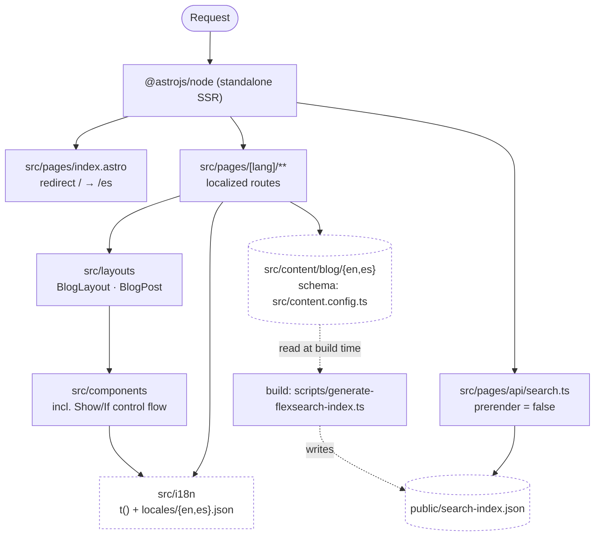

# CLAUDE.md

This file provides guidance to Claude Code (claude.ai/code) when working with code in this repository.

## Project Overview

Area 73 (erades.com) — a multilingual (es/en) blog built with Astro 7 (server output, Node adapter, standalone mode), TypeScript (strict), and Tailwind CSS v4. Content is authored as Markdown/MDX and rendered via Astro content collections; search is powered by a build-time FlexSearch index served through an SSR API route. Package manager is **pnpm** (see `packageManager` in `package.json`); Node >= 22.13.

Longer-form docs live in `docs/`: [`bejamas-ui.md`](docs/bejamas-ui.md) (how to bring in and adapt a UI primitive), [`bejamas-ui-presupuesto.md`](docs/bejamas-ui-presupuesto.md) (its measured cost), [`lighthouse.md`](docs/lighthouse.md) (the perf record), [`github-actions.md`](docs/github-actions.md) (CI/CD) and [`docker.md`](docs/docker.md) (visual baselines and the Playwright image).

## Commands

```bash
pnpm dev                    # Dev server at localhost:4321
pnpm build                  # Generates FlexSearch index, then astro build (SSR)
pnpm preview                # Preview the production build
pnpm start                  # Run the built server (dist/server/entry.mjs)

pnpm lint                   # ESLint on src, --max-warnings=0
pnpm lint:fix
pnpm typecheck               # tsc --noEmit

pnpm test:unit               # Vitest, single run, verbose
pnpm test:unit:watch         # Vitest watch mode
pnpm coverage                 # Vitest with V8 coverage
pnpm test:e2e                 # Playwright E2E; playwright.config.ts starts the server itself
pnpm test:e2e:headed          # Playwright headed with PWDEBUG
pnpm test:visual              # Visual regression (needs a server on :4321, see below)
pnpm test:visual:update       # Same, rewriting the snapshots

pnpm translate:es-en          # Translate es posts -> en via OpenAI (needs .env with OPENAI_API_KEY)
pnpm translate:en-es
```

Run a single unit test file: `pnpm exec vitest run src/components/BlogCard.test.ts`
Run a single Playwright spec: `pnpm exec playwright test path/to/file.spec.ts`

CI (`.github/workflows/ci.yml`) runs Lint-Check, Type-Check, Unit-Tests, E2E-Tests, Visual-Regression-Tests (Docker) and Build-App as separate jobs against `master`; `.github/workflows/security.yml` adds a `pnpm audit --audit-level moderate` job. Match these locally before pushing: `pnpm lint && pnpm typecheck && pnpm test:unit`.

## Architecture

### The shape of it



Two things worth reading off this diagram, because they are the ones people get
wrong: the search index is written **at build time** and re-read **per request**
(the API route rebuilds FlexSearch from the JSON on every call — nothing is kept
in memory), and `layouts` sit strictly between `pages` and `components`.

### Architectural boundaries

The layering above is enforced by `no-restricted-imports` in `eslint.config.js`,
so the `Lint` CI job fails if it drifts. The invariants:

| Rule | Why |
| --- | --- |
| Nothing imports from `pages/` | Routes are leaves — Astro is their only caller. Importing one means the logic belongs elsewhere. |
| Only `pages/` import `layouts/` | A component reaching for a layout is a render cycle waiting to happen. |
| `utils/` and `i18n/` import no UI | They are the base layer, and the only part directly unit-testable without a container render. |

Note that imports in this repo are written **relative**, not through the `~` /
`@components` aliases, so the ESLint patterns match path segments (`**/pages/**`)
rather than alias prefixes. Keep that in mind when adding a rule.

### Routing and i18n

- `output: "server"` with `@astrojs/node` (standalone). **Both** locales are prefixed (`/es/...` and `/en/...`), so `astro.config.mjs` sets `i18n.routing.prefixDefaultLocale: true`; `/` redirects via `src/pages/index.astro`. Do not flip that flag back to `false`: every page lives under `src/pages/[lang]/`, and Astro 7 then treats the default locale's prefix as an invalid route and 404s half the site.
- All localized pages live under `src/pages/[lang]/...` (e.g. `[lang]/blog/[...slug].astro`, `[lang]/blog/page/[page].astro`, `[lang]/tags/[tag]/[page].astro`). `lang` is validated/resolved per-route; there is no separate i18n routing middleware.
- `src/middleware.ts` does exist, but it has nothing to do with routing or i18n: it only stamps security headers (`X-Content-Type-Options`, `X-Frame-Options`, `X-XSS-Protection`) and a per-path `Cache-Control` on every response. If a route is being cached wrong in production, `getCacheControl()` there is the place — not the host config, which is deliberately provider-agnostic.
- Root-level files (`src/pages/index.astro`, `404.astro`, `rss.js`, `feed.js`, `en/rss.js`, `rss-viewer.astro`) exist outside `[lang]` for locale-root and cross-locale concerns (combined RSS feed, XSL viewer, etc). **But only the endpoints actually route**: with `prefixDefaultLocale: true` a non-prefixed `.astro` *page* never runs — `/rss` and `/feed` return 200 while `/rss-viewer` 404s (nothing links to it, so nobody noticed). Any new page goes under `src/pages/[lang]/`, even one that has nothing to say about language.
- Translation strings live in `src/i18n/locales/{en,es}.json`, accessed via `t(lang, key)` / `tWithInterpolation(lang, key, vars)` in `src/i18n/index.ts`. Missing keys return the key itself rather than throwing — check this when strings appear untranslated.

### Content collections

- Blog posts are Markdown/MDX under `src/content/blog/{en,es}/...` (subfolders like `functional/`, `patterns/`, `ai-take-aways/` group related posts but aren't a routing concept — the flat locale prefix is what matters).
- Schema is defined once in `src/content.config.ts` (zod): `title`, `description`, `pubDate`, `updatedDate?`, `heroImage?`, `tags[]`, `categories[]`, `draft`. When adding frontmatter fields, update this schema first — it's the single source of truth for content typing.
- `pnpm translate:*` scripts (`scripts/translate-posts.ts`) mirror posts between `en/` and `es/` via the OpenAI API — used to keep both locale trees in sync, not run automatically in CI.

### Search

- `pnpm build` first runs `scripts/generate-flexsearch-index.ts`, which walks `src/content/blog`, parses frontmatter with `gray-matter`, and writes a flattened doc list to `public/search-index.json` (locale-prefixed `path`, lowercase `id`).
- `src/pages/api/search.ts` is an SSR-only route (`export const prerender = false`) that loads that JSON at request time, builds ephemeral FlexSearch `Document`/`Index` instances (metadata fields + full content), and returns merged/deduplicated matches. The index is rebuilt per-request from the static JSON file, not persisted in memory — if search behavior seems stale, check whether `public/search-index.json` was regenerated.
- `SearchInput.astro` / `SearchPageWrapper.astro` / `HeaderSearchBox.astro` are the client-facing pieces that call this API.

### Component documentation

Every component in `src/components/**` carries a JSDoc block at the top of its
frontmatter, in the bejamas/ui tag format (`@component`, `@title`,
`@description`, `@usage`, and for the `ui/` primitives also `@preview`, `@api`,
`@examples`). `pnpm docs:components` extracts it to `docs/components/`, and
`/es/dev/componentes` renders it next to a live preview (dev only — the route
404s in production).

**A new component is not finished until it has that block and the docs are
regenerated.** Write only what a parser cannot deduce — what the component is
for and how it is used. The props table and the slot list are read from
`interface Props` and from the markup, so never hand-write them: they would go
stale on the next rename. Live previews are optional and live in
`src/components/dev/previews/<PascalCase>.astro`; a component without one shows
a note saying which file to add.

### Conditional-rendering component pattern

The codebase avoids ad-hoc `{condition && <div>}` sprinkled through templates in favor of small dedicated Astro components: `Show`/`ShowWhen`, `If`/`Then`/`Else`. These use named slots (`Astro.slots.has("then")`) rather than string/children inspection. Reuse these instead of reintroducing inline boolean rendering in `.astro` files.

### Layouts

- `BlogLayout.astro` and `BlogPost.astro` wrap `Header`/`Footer`/`BaseHead` and localized styles. `BlogPost` derives its `Props` from `CollectionEntry<"blog">["data"]` (with `pubDate` made optional) plus `lang` — keep layout props in sync with the content schema rather than redefining shapes.

### Path aliases

Defined in **three** places — `astro.config.mjs`, `vitest.config.ts` and `tsconfig.json` (`paths`). Adding or changing one means touching all three:
- `@components` → `src/components`
- `~` → `src`
- `@/` → `src/` — exists only because bejamas/ui registry components are written against `@/lib/utils`. Prefer `~` for repo code.

### UI primitives (bejamas/ui)

`src/components/ui/**` holds components **copied from the bejamas/ui registry** (`separator`, `dropdown-menu`, `dialog`), driven at runtime by the `@data-slot/*` packages. They are the only components in the repo that carry client JS.

- Copy them with `pnpm tsx scripts/add-bejamas-component.ts <name>`, never with `bejamas add` — that CLI adds itself to `dependencies`, injects `@apply` into the global CSS (forbidden here) and writes a placeholder into `pnpm-workspace.yaml` that breaks `pnpm install --frozen-lockfile`.
- Registry files carry a `Do not edit` header, and the copy step overwrites them. Deliberate deviations are allowed but **must** be commented in place with the reason, or the next copy silently reverts them.
- Every registry component ships classes that are dead in this repo (`animate-in`/`fade-*`/`zoom-*` need `tw-animate-css`; `cn-menu-*`/`no-scrollbar` come from `bejamas/tailwind.css`; `w-[var(--anchor-width)]` references a variable the runtime never writes). Prune them on copy.
- Put `data-slot="<component>-trigger"` on the real `<button>` rather than using the registry `Trigger`: the runtime writes `aria-expanded`/`aria-haspopup` wherever that attribute sits, and `Trigger` puts it on an intermediate `<div>` (and drags in `class-variance-authority`).
- Trigger and content must share one `data-slot` root — this is why the avatar button lives in `SocialProfileMenu.astro` and not in `Header.astro`.
- `@data-slot/core` (16 KB raw) is already paid for; each new primitive only adds its own package. Nothing gates bundle size — no Lighthouse budgets exist any more — so check the deterministic `js` field in `lh.ndjson` before and after a migration.

Full playbook, including which remaining components are worth migrating (and which are not — `BlogFilters` uses a native `<select>`), in `docs/bejamas-ui.md`; the measured cost of the two migrations done so far in `docs/bejamas-ui-presupuesto.md`.

## Conventions

These come from `.cursor/rules/*.mdc` and apply to Claude Code edits too:

- **Astro components**: filenames PascalCase (`^[A-Z][a-zA-Z0-9]*\.astro$`); define props via `interface Props`; use `class`, never `className`, in `.astro` markup; never use Tailwind's `@apply`.
- **TypeScript files**: kebab-case filenames; camelCase vars/functions; PascalCase types/interfaces/classes; `import type` for type-only imports (top-level, not inline `import { type X }`); no default exports unless the framework requires one; prefer `interface extends` over `&` intersections for inheritance; `readonly` properties by default; explicit return types on top-level functions (except components returning JSX/Astro templates); avoid `any` outside generic function bodies; prefer discriminated unions over "bag of optional fields" types; don't add new TS `enum`s — use `as const` objects instead.
- **Strict mode**: `tsconfig.json` extends `astro/tsconfigs/strict` — `noUncheckedIndexedAccess` semantics apply (indexed access returns `T | undefined`).
- **Error handling**: prefer a `Result<T, E>`-style return over throwing for code whose caller would need a manual try/catch; reserve throws for cases where the framework/runtime is expected to catch them.
- **No `console.log`** left in `.ts`/`.astro` files.
- Favor early returns and named intermediate variables over deeply nested/compound conditionals.

## Testing

- Unit tests (Vitest + happy-dom) are colocated next to source, e.g. `src/components/BlogCard.astro` + `src/components/BlogCard.test.ts`. Config: `vitest.config.ts`, setup in `src/test/setup.ts`.
- Astro components are unit-tested by rendering through `AstroContainer` via the `renderAstroComponent` helper in `src/test/helpers.ts`, then asserting on the resulting DOM (e.g. with `@testing-library/dom`'s `getByText`). Follow this pattern (see `show.test.ts`) rather than snapshotting raw HTML strings.
- E2E specs run with Playwright: `playwright.config.ts` for functional E2E, `playwright.visual.config.ts` for visual regression. `pnpm test:e2e` runs Playwright directly and its `webServer` block builds and starts the app itself (`pnpm build && pnpm start`), so nothing needs to be running beforehand. The visual suite has no `webServer` — it expects a server already listening on `BASE_URL` (default `http://localhost:4321`).
- In CI the visual job runs **inside** the official Playwright image via the `container:` block in `.github/workflows/ci.yml`, on an amd64 runner, which is what makes the baselines reproducible.
- That job skips itself on pull requests that only touch `docs/` or a root-level `.md`, since those cannot move a pixel. The filter lives in the `Decidir si la suite visual aplica` step rather than in a workflow-level `paths-ignore`, because a *skipped* required check stays "pending" forever and blocks the merge. Note it deliberately does **not** treat every `*.md` as docs: posts live in `src/content/blog/**/*.md` and changing one moves the listing and the paginator.
- `retries` is `0` and `video` is `off` in `playwright.visual.config.ts`. Both follow from the determinism the rest of that config buys: if a screenshot is flaky the fix is to stabilise the capture, not to retry it, and a video of a static page tells you less than the `-diff.png` already does. Keep that image tag and the `@playwright/test` version in `package.json` in sync — a mismatch is a known source of CI failures (see `docs/docker.md`). Dependabot excludes `@playwright/test` from its grouped PRs so the bump arrives alone and visible.

### Running the visual suite locally

The visual config has no `webServer`, so it drives a server you start yourself.
Use the **production** server, not `pnpm dev`:

```bash
pnpm build
PORT=4321 pnpm start   # then, in another shell:
pnpm test:visual
```

`pnpm dev` does not work for this since Astro 7: `astro dev` binds only to IPv6
`[::1]`, so `127.0.0.1:4321` is refused.

Symptom to recognize: *every* visual test failing with a 30s timeout waiting for
a selector means nothing is listening on `BASE_URL`, not a render regression.
Check with `curl -sI http://localhost:4321/es` before suspecting the CSS.

Expect local runs to differ from CI: you are rendering with your own machine's
browser and fonts. On Apple Silicon the diffs are substantial. That is fine for
seeing *what* changed — never for blessing a new baseline.

### Visual baselines

Baselines are authoritative **from CI** and should not be regenerated locally: on Apple Silicon the `linux/amd64` runner is emulated and text rasterization differs, which produces ~250 px diffs indistinguishable from a real regression.

To refresh them, run the CI workflow with `update_visual_snapshots=true`, download the `playwright-updated-snapshots` artifact, and copy it over `tests/visual-regression/visual-regression.spec.ts-snapshots/`. Before committing, diff the new baselines against the old ones and confirm the change is what you expect — a snapshot whose **dimensions** change is a layout shift, not antialiasing, and deserves a look.

## Docker / Lighthouse

- `Dockerfile` builds the production standalone server. There is no test-runner image any more: CI gets its pinned browser from the `container:` block in `ci.yml`, and local runs use the host's Playwright install.
- Lighthouse measures **production** (`erades.com`), never the local preview, and appends one NDJSON row per `(url, form factor)` to `lh.ndjson`. Git is the history — there is no LHCI server, no Docker, no SQLite. `lighthouserc.prod.cjs` holds the URLs; `lighthouserc.prod.desktop.cjs` derives from it and only swaps the form factor. `.github/workflows/lighthouse.yml` runs it weekly and on `workflow_dispatch`.
- **The record lives on the orphan `metrics` branch, not on `master`**, and is never merged. Render deploys this repo with `autoDeploy` on commit and no build cache, so a weekly bot commit to `master` would trigger a full production rebuild for a data file that does not touch the site. Read it with `git log -p origin/metrics -- lh.ndjson`. Locally, `pnpm lh:collect && pnpm lh:record` writes to `metrics/` — gitignored, a scratch draft; CI points `LH_OUT` at its checkout of the branch.
- That workflow deliberately does **not** trigger on `push` to `master`: Render deploys in parallel, so there is no way to know whether `erades.com` is already serving the new commit, and measuring there would file the old version under the new hash. Trigger it by hand after a deploy you care about.
- In `lh.ndjson` the byte fields (`js`, `css`, `img`, `bytes`) are deterministic and a rise in them is always a real regression; the timing fields are not — GitHub runners swing ±5 `perf` points between identical runs, so read those as multi-week trends, never as a per-commit delta. Rows before 2026-08-21 have null bytes, and their `desktop` rows were measured with mobile throttling. See `docs/lighthouse.md`.
